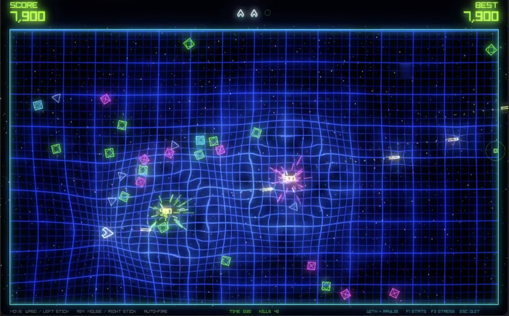

# WIPE: SURVIVAL



A native With + raylib twin-stick survival prototype. Luminous wireframes on
a blue lattice that warps around the ship, bullets, and explosions; two-tier
Gaussian bloom; line-spark explosions; floating kill scores; and a bass-led
ambient house soundtrack. One arena, four chaser silhouettes (lime blocks,
magenta spinners, blue darts, cyan weavers) that share one behavior, one-hit
kills, automatic fire, and immediate retry. Kills score 100 times a
multiplier that rapid kills build and idle time decays.

## Specs

The recruiting prototype spec is complete and signed off; this tree is its
result. The game is specified in one document,
[docs/wipe-survival-spec.md](docs/wipe-survival-spec.md): Geometry Wars' feel
on Vampire Survivors' loop, with milestones at the end.
[docs/wipe-survival-implementation-notes.md](docs/wipe-survival-implementation-notes.md)
carries the engineering notes, written against the current language with
this tree as the baseline.

## Build and play

Requires the With compiler, raylib 6.0, and SDL3 3.4.14 (the Conan package is
named `sdl`). Both native dependencies are pinned in `with.toml`. SDL handles
native controller transport and mapping; raylib handles graphics and audio.

```sh
with get c.raylib@6.0
with get c.sdl@3.4.14
with build
./out/bin/wipe
```

The build copies the checked-in audio and GLSL shaders beside the executable.
The executable resolves assets from its own directory, so it can be launched
from another working directory. When distributing it, include `out/bin/assets/`.
A desktop OpenGL 3.3 context and audio output are expected. Failure to load
required shaders/assets is reported instead of silently displaying substitutes.
An unavailable audio device permits silent play.

| Action | Keyboard/mouse | Controller |
| --- | --- | --- |
| Move | WASD or arrows | Left stick |
| Aim | Mouse | Right stick |
| Fire | Automatic | Automatic |
| Retry after death | Space | A / south face button |
| Performance overlay | F1 | — |
| Populate 350 enemies | F3 | — |
| Quit | Escape | — |

Xbox and Steam controllers use SDL's native gamepad mapping. The first available
mapped controller stays selected until it disconnects; WIPE then looks for a
replacement twice per second. Both sticks have a radial deadzone, and centered
aim retains the last direction. Moving the mouse returns to mouse aiming.
Gameplay input is ignored while the game window is unfocused.

For the Steam Controller, quit Steam and Steam Controller Bridge, connect the
Puck over USB, and wake the paired controller. Steam Input, keyboard/mouse
translation, and an additional bridge board are not required. Direct cable
operation and Xbox hardware still need separate acceptance checks.

On macOS, Steam's `ipcserver` helper can remain running after Steam quits. If
the Puck is visible but no native controller is detected, first close the game
and other controller tools, then stop that helper for the current login:

```sh
launchctl bootout user/$(id -u)/com.valvesoftware.steam.ipctool
```

Launching Steam later can register the helper again. Reconnect the Puck and
wake the paired controller; its light should be solid white for Puck mode.
This is troubleshooting guidance from the [Steam Controller Bridge guide](https://github.com/tkubicz/steam-controller-bridge/blob/main/docs/USER_GUIDE.md#3-connect-the-steam-controller-2),
not a permanent system configuration change. A missing launchd service means
the helper is already stopped.

To inspect native input before playing:

```sh
with build :controller-uat
./out/bin/controller-uat
```

Move both sticks and press A; the screen marks each control when observed.
Disconnect and reconnect to check recovery. Escape closes the test and prints
the observed controls and mean/peak polling time. A device being detected alone
does not establish full hardware acceptance.

## Acceptance and performance

```sh
with build :test
with run test/test_main.w --debug-alloc
with build :uat
mkdir -p out/uat
./out/bin/uat > out/uat/capped-performance.txt
WIPE_BENCH=1 ./out/bin/uat > out/uat/uncapped-performance.txt
with build :audio-uat
./out/bin/audio-uat
```

The controller tests use process-local SDL virtual devices to verify axis
mapping, simultaneous movement/aim, retry edges, held-button connection,
disconnect, and reconnect. They do not create a system-wide virtual controller.

The separate `uat` executable drives a deterministic fixture through 150,
350, and 512 enemies, sustained particles, death, and retry. Only this runner
disables contact damage and supplies automated aiming/movement. The playable
entry point contains neither behavior. Capped runs save gameplay/stress/death/
restart PNGs; uncapped runs measure throughput without screenshot I/O. The
histograms report 0.25 ms upper-bound buckets, mean, and peak. CPU render
submission is measured separately from `EndDrawing`; it is not GPU timer data.

The audio acceptance runner checks real playback, wrap across the loop seam,
and music continuity through a game reset. Subjective listening and controller
hardware acceptance are tracked separately in `docs/verification/report.md`.

## Showcase recording

The following optional development workflow uses the already-installed ffmpeg
and Python's standard library. Neither is needed to build or run the game.

```sh
with build :uat
mkdir -p out/uat/frames
WIPE_RECORD=1 ./out/bin/uat > out/uat/recording-events.txt
python3 tools/encode_clip.py
```

This creates `out/uat/wipe-showcase.mp4`: a 33-second, 30 FPS deterministic
recording of the real simulation/renderer, with music and event-synchronized
sound effects. Capture I/O is excluded from performance claims. The clip is
an automated fixture, not a human playthrough or a hardware certification.

## Code and assets

- `src/main.w`: playable lifecycle and fixed-step loop.
- `src/game.w`: deterministic simulation, preallocated pools, local separation.
- `src/tuning.w`: gameplay knobs, independent from presentation.
- `src/input.w`: radial deadzones and keyboard/mouse/controller arbitration.
- `src/gamepads.w`, `src/sdl.w`: native controller discovery, ownership, mapping.
- `src/presentation.w`: sharp gameplay geometry, effects, HUD, render passes.
- `src/shaders.w`: owned shaders and the narrow typed GPU-uniform boundary.
- `src/audio.w`: owned sound/music resources and per-frame playback.
- `src/uat.w`, `src/audio_uat.w`, `src/controller_uat.w`, `test/`: acceptance and measurement.

The original procedural WAV assets and shader sources are checked in. See
`assets/README.md` for provenance. Regenerate audio with
`python3 tools/synthesize_audio.py` only when changing the palette.
