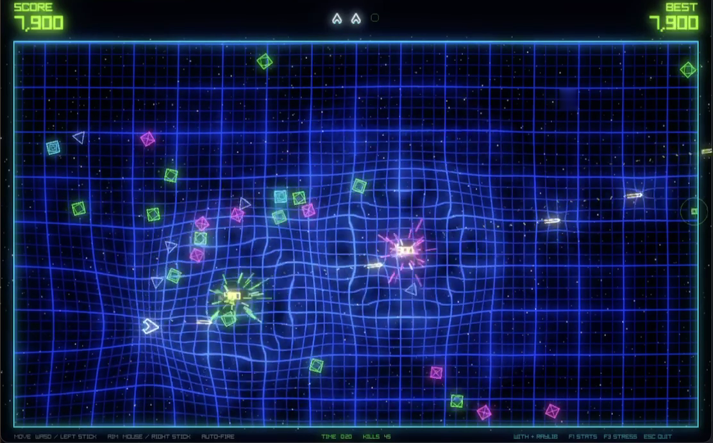

# WIPE: SURVIVAL



A native With + raylib twin-stick survivor: Geometry Wars' feel on Vampire
Survivors' loop. Luminous wireframes on a blue lattice that warps around the
ship, bullets, and explosions; two-tier Gaussian bloom; line-spark
explosions; a bass-led ambient house soundtrack.

A run is up to twenty minutes in a bounded, camera-followed arena. Kills
drop cores; cores fill the level-up bar and the combo; every level is a
choice of three cards from eight weapons, fourteen passives, and twelve
merges. Elites drop caches, beacons drop pickups, bosses arrive at five,
ten, and fifteen minutes, and the Null ends the run at twenty. Credits are
banked whatever happens and spent in a refundable shop. Nine ships, four
stages, and a registry of every enemy unlock from run facts. The save is
read before the first frame and written atomically with a backup on every
change.

## Specs

The recruiting prototype spec is complete and signed off; this tree is its
result. The game is specified in one document,
[docs/wipe-survival-spec.md](docs/wipe-survival-spec.md): Geometry Wars' feel
on Vampire Survivors' loop, with milestones at the end.
[docs/wipe-survival-implementation-notes.md](docs/wipe-survival-implementation-notes.md)
carries the engineering notes, written against the current language with
this tree as the baseline.

## Build and play

Requires the With compiler, raylib 6.0, and SDL3 3.4.14 (the Conan package is
named `sdl`). Both native dependencies are pinned in `with.toml`. SDL handles
native controller transport and mapping; raylib handles graphics and audio.

```sh
with get c.raylib@6.0
with get c.sdl@3.4.14
with build
./out/bin/wipe
```

The build copies the checked-in audio and GLSL shaders beside the executable.
The executable resolves assets from its own directory, so it can be launched
from another working directory. When distributing it, include `out/bin/assets/`.
A desktop OpenGL 3.3 context and audio output are expected. Failure to load
required shaders/assets is reported instead of silently displaying substitutes.
An unavailable audio device permits silent play.

| Action | Keyboard/mouse | Controller |
| --- | --- | --- |
| Move | WASD or arrows | Left stick |
| Aim | Mouse | Right stick |
| Fire | Automatic | Automatic |
| Confirm, retry, launch, buy | Space, Enter, or click | A |
| Back | Escape | B |
| Shop | X | X |
| Collection | C | Y |
| Boost: pick a card | 1-4, arrows, or click | D-pad or stick, then A |
| Boost: reroll, skip, banish | R, K, N | X, Y, LB |
| Retry as a newly unlocked ship | Tab | RB |
| Stage, tabs, shop sort | Q, E | LB, RB |
| Pause and settings | Escape in a run | Menu/Start |
| Fullscreen | F11, or pause settings | Pause settings |
| Leave the run for the title | Escape or Q in pause | Quit to title in pause |
| Quit | Escape or Q on the title | Hold B on the title |
| Performance overlay and session metrics | F1 | — |
| Fill the arena to the stress budget | F3 | — |

The save lives in the per-user data directory (`~/Library/Application
Support/WIPE` on macOS, `%APPDATA%\WIPE` on Windows, `$XDG_DATA_HOME/wipe`
elsewhere). `WIPE_SAVE_DIR` overrides it, which the tests and the tour use.
A fresh save launches straight into a run as the Claw.

Xbox and Steam controllers use SDL's native gamepad mapping. The first available
mapped controller stays selected until it disconnects; WIPE then looks for a
replacement twice per second. Both sticks have a radial deadzone, and centered
aim retains the last direction. Moving the mouse returns to mouse aiming.
Gameplay input is ignored while the game window is unfocused.

The view follows the display's aspect ratio, with a 1280×800 minimum; the
scene renders at the output's pixel size. Pause settings include fullscreen,
VSync, and a frame limit (display refresh, 30, 40, 45, 60, 90, or 120 FPS).
Prompts follow the last used input device. The Collection's Awards tab shows
all 29 local achievements, including in the plain build.

## Testing the optional Steam build

The default `wipe` target runs independently of Steam. The separate
`wipe-steam` target adds achievement synchronization and pauses play when the
Steam overlay opens. It remains playable if Steam initialization fails.
When Steam manages controllers, WIPE accepts its mapped gamepad through SDL.

This work currently needs the candidate With compiler with C++-header
`c_import`, `Target.library_path`, and `Target.rpath` support. Supply the local
[Steamworks SDK headers](vendor/steamworks/README.md), then use that compiler:

```sh
with build :wipe-steam
with build :steam-uat
WIPE_STEAM_DISABLE=1 ./out/bin/steam-uat
```

For the real SDK test, use a Steam test account with Spacewar and a local
`steam_appid.txt` containing `480` in the working directory. Run
`./out/bin/steam-uat`; it queries, clears, stores, sets, and restores one
Spacewar achievement. `--overlay` also waits for an overlay open/close cycle.
The test achievement must initially be locked, so an existing unlock's
timestamp is never replaced. Use a disposable test account: Steam may retain
unlock history even after the visible flag is restored.
`--probe` checks initialization and query without changing achievements;
`--store-unchanged` queries the original test achievement flag, submits the
client's unchanged stats through `StoreStats`, waits for a successful
manual-dispatch store callback, and verifies the flag is unchanged. It adds
no earned achievements and makes no unlock or reset calls. This mode still
submits stats to Steam; it is separate from the mutation test above.
`--overlay-only` checks overlay callbacks without changing achievements;
`--no-stats` checks cleanup after a successful initialization with an
unavailable stats interface. With Steam disconnected, `--expect-unavailable`
checks the actual SDK failure path.
The harness refuses achievement changes for any App ID other than 480 and
reports failure if it cannot confirm restoration. The file is ignored by Git.
Never test WIPE's achievement IDs against Spacewar.

`src/steam_config.w` deliberately has no production App ID yet. Local
packaging uses an explicit file list: `with build :package` stages the plain
game; `:package-steam` requires WIPE's assigned App ID. Neither command uploads
or publishes anything. Development App ID files and SDK headers are excluded.
Hardware checks and outstanding acceptance are tracked in
[the Steam and Deck plan](docs/steam-and-steam-deck-support.md).

## Standalone Steam Controller setup

For the Steam Controller, quit Steam and Steam Controller Bridge, connect the
Puck over USB, and wake the paired controller. Steam Input, keyboard/mouse
translation, and an additional bridge board are not required. Direct cable
operation and Xbox hardware still need separate acceptance checks.

On macOS, Steam's `ipcserver` helper can remain running after Steam quits. If
the Puck is visible but no native controller is detected, first close the game
and other controller tools, then stop that helper for the current login:

```sh
launchctl bootout user/$(id -u)/com.valvesoftware.steam.ipctool
```

Launching Steam later can register the helper again. Reconnect the Puck and
wake the paired controller; its light should be solid white for Puck mode.
This is troubleshooting guidance from the [Steam Controller Bridge guide](https://github.com/tkubicz/steam-controller-bridge/blob/main/docs/USER_GUIDE.md#3-connect-the-steam-controller-2),
not a permanent system configuration change. A missing launchd service means
the helper is already stopped.

To inspect native input before playing:

```sh
with build :controller-uat
./out/bin/controller-uat
```

Move both sticks and press A; the screen marks each control when observed.
Disconnect and reconnect to check recovery. Escape closes the test and prints
the observed controls and mean/peak polling time. A device being detected alone
does not establish full hardware acceptance.

## Recordings, the run log, and live tuning

Every run is recorded and logged beside the save (see the save location
above):

- `runs/run-N-SHIP.rec`: the seed, the account, the tuning, and every input
  the simulation received. Inputs are quantized to 1/4096 before the
  simulation sees them, so a recording replays exactly, and any bug you hit
  can be reproduced from its file.
- `runs.tsv`: one line per run: ship, stage, length, level, kills, hits,
  killer, build, and every card offered and taken.
- `tuning.txt`: optional knob overrides as `name value` lines. The game
  reloads it every second, applies changes to the run in progress, and
  records them. `tuning.defaults.txt` lists every knob and its built-in
  value. `WIPE_TUNING` points at a different file.

The `runs` tool works on those files without a window:

```sh
with build :runs
./out/bin/runs replay            # every recording replays exactly, or says where it diverged
./out/bin/runs calibrate         # your runs beside the careful bot on the same seeds
./out/bin/runs profile 16        # every ship, stationary and careful, across a whole run
```

`with build :test` holds the balance targets: a standing-still Claw dies
in 7 to 14 seconds as in Vampire Survivors, each ship stays inside the
opening, middle, and late bands of its profile in spec §9, and every
weapon and merge stays inside its kill-rate band. The suite takes about two
minutes because of these.

## Acceptance and performance

```sh
with build :test
with run test/test_main.w --debug-alloc
with build :uat
mkdir -p out/uat
./out/bin/uat > out/uat/capped-performance.txt
WIPE_BENCH=1 ./out/bin/uat > out/uat/uncapped-performance.txt
with build :audio-uat
./out/bin/audio-uat
```

The controller tests use process-local SDL virtual devices to verify axis
mapping, simultaneous movement/aim, retry edges, held-button connection,
disconnect, and reconnect. They do not create a system-wide virtual controller.

The separate `uat` executable drives a deterministic fixture through 150,
350, and 1,800 enemies, sustained particles, death, and retry. Only this
runner disables contact damage and supplies automated aiming/movement. The
playable entry point contains neither behavior. Capped runs save
gameplay/stress/death/restart PNGs; uncapped runs measure throughput without
screenshot I/O. The histograms report 0.25 ms upper-bound buckets, mean, and
peak. CPU render submission is measured separately from `EndDrawing`; it is
not GPU timer data.

The `gallery` executable stages every in-run element in the real simulation
and renderer (each weapon just after it fires, every enemy and elite, the
boss and the Null, every pickup, the level-up, merge, cache, boss, event,
death, and reboot moments, every ship, and a late-run swarm with real
contact) and writes one PNG each to `out/gallery/`. It is the visual review
against the prototype's frames in `docs/verification/`:

```sh
with build :gallery
mkdir -p out/gallery
./out/bin/gallery
```

The `bosses` executable fights each boss with a build typical of its minute,
flown by the careful bot and by a ship that stands still, and flies a fresh
account to ten minutes. It reports time to kill, hits, deaths, and how far
fresh runs get:

```sh
with build :bosses
./out/bin/bosses
```

The `play` executable is the playtest driver. A scripted player drives the
real app through the same input path as the keyboard and pad: title, ship
select, full runs that aim and dodge, every boost action, pause, abandon,
death, results, retry, the shop with a refund, and the collection. It
checks invariants every frame, logs each run the way a playtester would
note it, and saves frames to `out/play/`. `WIPE_PLAY_VETERAN=1` starts from
an account with everything open, which reaches stages, endless, and every
ship:

```sh
with build :play
mkdir -p out/play
WIPE_SAVE_DIR=/tmp/wipe-play ./out/bin/play 10
WIPE_PLAY_VETERAN=1 WIPE_SAVE_DIR=/tmp/wipe-vet ./out/bin/play 8
```

The `balance` executable measures every weapon and merge alone against
the same minute-eight swarm and prints kills per minute by level, so a
weapon that is too strong or too weak reads as a number:

```sh
with build :balance
./out/bin/balance
```

The `tour` executable walks every screen against a scratch save and writes
one PNG per screen to `out/tour/`:

```sh
with build :tour
mkdir -p out/tour
WIPE_SAVE_DIR=/tmp/wipe-tour ./out/bin/tour
```

Set `WIPE_TOUR_HIGHDPI=1` to exercise the production window's high-density
framebuffer on a Retina display. The default keeps fixed-size output captures
unchanged. `WIPE_TOUR_VIEW=1422x800` chooses logical coordinates, and
`WIPE_TOUR_OUTPUT=1920x1080` chooses the window size; the tour logs the actual
window, framebuffer, and rendering surface sizes separately.

The audio acceptance runner checks real playback, wrap across the loop seam,
and music continuity through a game reset. Subjective listening and controller
hardware acceptance are tracked separately in `docs/verification/report.md`.

## Showcase recording

The following optional development workflow uses the already-installed ffmpeg
and Python's standard library. Neither is needed to build or run the game.

```sh
with build :uat
mkdir -p out/uat/frames
WIPE_RECORD=1 ./out/bin/uat > out/uat/recording-events.txt
python3 tools/encode_clip.py
```

This creates `out/uat/wipe-showcase.mp4`: a 33-second, 30 FPS deterministic
recording of the real simulation/renderer, with music and event-synchronized
sound effects. Capture I/O is excluded from performance claims. The clip is
an automated fixture, not a human playthrough or a hardware certification.

## Code and assets

- `src/main.w`, `src/main_steam.w`: plain and optional Steam entry points.
- `src/run.w`: window, devices, and the shared frame loop.
- `src/platform.w`, `src/steam.w`, `src/achievement_sync.w`: optional platform
  services, Steam callbacks, and achievement upload retries.
- `src/app.w`: the screens of spec §11 (title, ship select, run, pause,
  results, shop, collection) and every transition between them.
- `src/game.w`: the deterministic simulation: arena, camera, timeline,
  enemies and their behaviors, weapons, cores, pickups, beacons, boosts,
  caches, merges, death record.
- `src/loadout.w`: weapons, passives, merge recipes, and the run's build.
- `src/ships.w`: the roster and unlock conditions.
- `src/tuning.w`: gameplay knobs, the spawn curve, events, and stages.
- `src/account.w`: shop prices and ranks, unlock progress, open loops,
  session metrics.
- `src/save.w`: the versioned save file, atomic writes, backup and restore.
- `src/input.w`: radial deadzones, keyboard/mouse/controller arbitration,
  and menu input.
- `src/gamepads.w`, `src/sdl.w`: native controller discovery, ownership, mapping.
- `src/presentation.w`: world and HUD geometry, ship and enemy silhouettes,
  icons, the boost overlay, render passes and bloom.
- `src/shaders.w`: owned shaders and the narrow typed GPU-uniform boundary.
- `src/audio.w`: owned sound/music resources and per-frame playback.
- `src/record.w`: recordings and exact replay. `src/pilots.w`: the bots shared
  by tests, benches, and calibration. `src/runs.w`: the replay, calibrate,
  and profile tool.
- `src/uat.w`, `src/play.w`, `src/balance.w`, `src/tour.w`, `src/gallery.w`, `src/audio_uat.w`, `src/controller_uat.w`, `test/`:
  acceptance and measurement.

The original procedural WAV assets and shader sources are checked in. See
`assets/README.md` for provenance. Regenerate audio with
`python3 tools/synthesize_audio.py` only when changing the palette.
