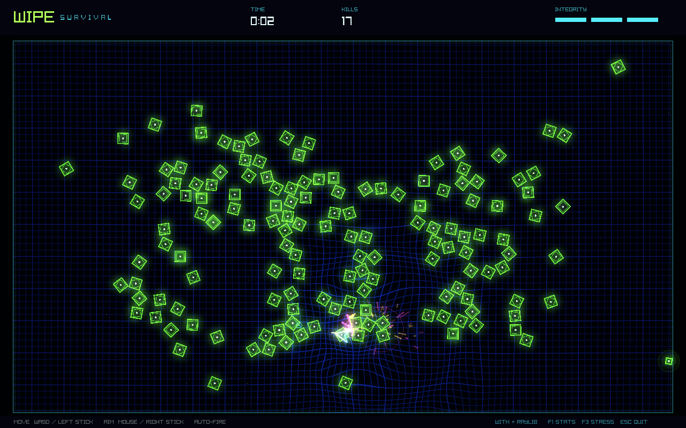
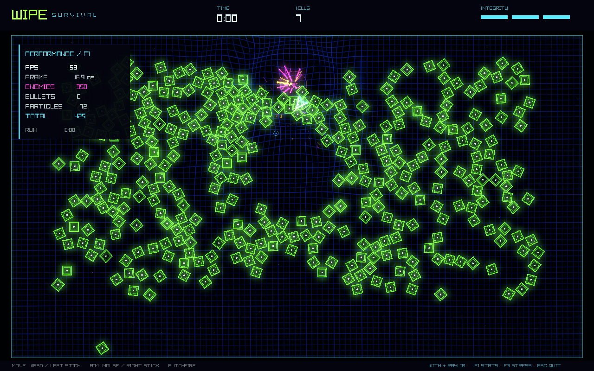
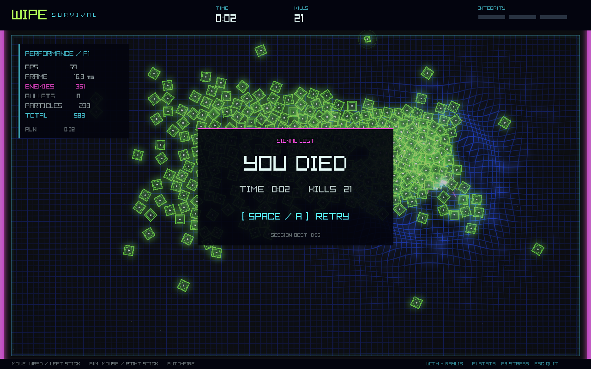
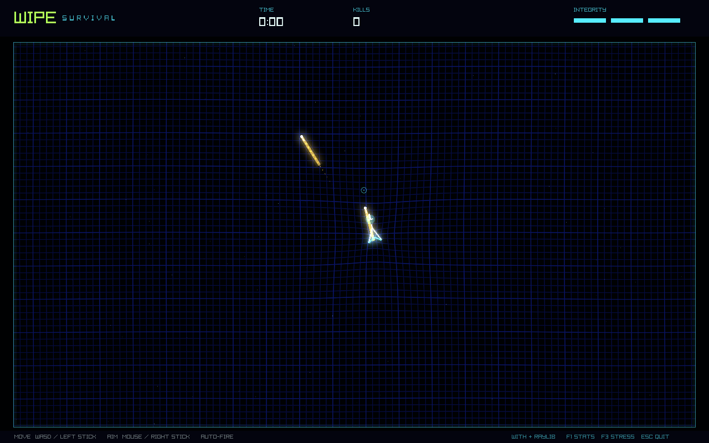

# WIPE acceptance record

Recorded 2026-09-25 UTC. This is a working prototype with measured desktop
evidence. The full specification is **not yet signed off**: physical controller
acceptance, Steam Deck performance, and subjective audio approval remain open.

## Build and functional acceptance

With v0.15.2.1, raylib 6.0, Apple M5 Max, 128 GiB RAM, macOS 26.6.2.
Rendering used a 1280 × 800 desktop window, the reactive grid shader,
quarter-resolution separable Gaussian bloom, and the final composite pass.

Passed during implementation:

- `with build`, `with build :uat`, and `with build :audio-uat`.
- `with build :test`: independent movement/aim, diagonal normalization,
  analog magnitude, arena limits, firing cadence, swept collision, one-hit
  enemy death, damage invulnerability, death, retry, escalation, bounded
  pools, deterministic replay, configurable rules, radial deadzones,
  color/alpha contracts, and timing histogram behavior.
- `with run test/test_main.w --debug-alloc`: reported zero leaked allocations
  for the simulation tests. This is not a whole-application GPU/audio leak audit.
- Real GPU acceptance fixture completed ordinary combat, 350-enemy stress,
  death, retry, and maximum-load stages without a shader validation failure.
- Real audio-device acceptance verified valid assets, playback across the
  34.909-second loop boundary, and preservation of music position through
  gameplay reset. See [audio log](audio-acceptance.txt).
- The playable executable launched from `/private/tmp` without asset-load
  errors. Desktop automation could not select the unbundled native executable,
  so this check does not establish end-to-end keyboard acceptance.

The desktop fixture is a separate executable. It supplies scripted movement
and aim, disables contact damage, and forces the death/retry sequence. The
playable executable uses real input and normal contact damage. Neither the
fixture nor the clip is a human playthrough.

## Performance

Target-capped run (60 FPS requested; observed pacing approximately 59 FPS):

| Workload | Samples | Mean frame | p95 upper bound | Peak frame |
| --- | ---: | ---: | ---: | ---: |
| 150 enemies | 297 | 16.93 ms | 17.25 ms | 17.16 ms |
| 350 enemies | 157 | 16.94 ms | 17.25 ms | 17.21 ms |
| 512 enemies + sustained particles | 329 | 17.04 ms | 17.25 ms | 17.30 ms |

Uncapped run:

| Workload | Samples | Mean frame | p95 upper bound | Peak frame |
| --- | ---: | ---: | ---: | ---: |
| 150 enemies | 299 | 1.78 ms | 4.25 ms | 15.31 ms |
| 350 enemies | 159 | 2.12 ms | 4.25 ms | 4.39 ms |
| 512 enemies + sustained particles | 329 | 5.49 ms | 7.75 ms | 9.02 ms |

Both runs observed peaks of 512 enemies and 1,512 active particles. The capped
run's simulation CPU mean was 0.119 ms (maximum 0.374 ms); render submission
CPU averaged 3.008 ms (maximum 6.349 ms). Reset reused its pools and measured
below the histogram's 0.25 ms bucket resolution in a single sample. The next
rendered frame showed fresh gameplay. This is not a measured physical
button-to-photon latency result.

Frame intervals include rendering and presentation. CPU render submission
excludes `EndDrawing`; no GPU timer query was used. Percentiles are 0.25 ms
histogram upper bounds. Initial warm-up and frames affected by PNG readback
were excluded; the uncapped run took no screenshots. These are short fixture
runs on one development Mac, not long-duration or Steam Deck certification.

Raw results: [capped](capped-performance.txt),
[uncapped](uncapped-performance.txt). Reproduction commands are in
[README](../../README.md).

## Visual review

Inspected the actual GPU captures below and decoded frames from the completed
video at 10, 20, 27.25, and 30.4 seconds.

- Dense blue grid bends around the player and carries expanding impact waves.
- Green wireframe enemies retain defined edges under bloom; white/cyan player
  geometry and gold projectiles remain distinct from magenta kill sparks.
- Directional sparks, luminous trails, rings, and brief flashes provide the
  requested Geometry Wars direction without introducing extra enemy types.
- HUD and death/retry text remain sharp because they render after bloom.
- At 350 enemies, closely packed shapes still merge into bright clusters.
  This remains a tuning concern, especially on a smaller display; the result
  does not yet reproduce the reference's full particle density or variety.

The local showcase is `out/uat/wipe-showcase.mp4`: 33.0 seconds, 1280 × 800,
30 FPS H.264, stereo 44.1 kHz AAC, approximately 44.6 MB. It uses the real
simulation/rendered frames and an offline mix of the same music/effects,
volumes, pitch variation, and recorded gameplay events. It is not an audio
loopback recording. Its mix peaked at -4.68 dBFS before AAC encoding, without
needing safety attenuation. Generated video/frame files remain outside source
control; the smaller screenshots and measurements are preserved here.

## Audio review

The checked-in original soundtrack provides a 110 BPM house pulse, layered
ambient chords, sub-bass, light percussion, and delay. Five original effects
provide shot, enemy hit/death, and player damage/death cues. At the current
one-hit setting, the kill cue takes precedence over the hit cue. Events are
coalesced per rendered frame, with one reusable sound resource per cue.

The music WAV has a -2.38 dBFS sample peak, -14.93 dBFS RMS, no clipped samples,
and a -64.29 dBFS endpoint discontinuity. All five effect WAVs also have zero
clipped samples. See [sample analysis](audio-analysis.json). These checks
establish signal headroom and a small loop seam; they do not establish
professional artistic quality, perceived loudness, or speaker translation.

**Listening review is pending.** Review ordinary and dense combat on headphones
and Steam Deck speakers, including repeated retry and at least two complete
music loops. Confirm bass weight without masking, comfortable high frequencies,
clear damage/death cues, and an engaging meditative flow. The procedural music
and effects are the first reviewable candidate, not an approved final master.

## Remaining hands-on acceptance

No controller was connected during the desktop runs (reported count: 0).

| Check | Procedure | Status |
| --- | --- | --- |
| Desktop input | Move with WASD while independently sweeping mouse aim; verify F1, F3, Space retry, Escape | Pending end-to-end UI check |
| Xbox dual sticks | Move and aim simultaneously; test partial magnitude, diagonals, centered-stick aim retention, A retry | Pending hardware |
| Xbox reconnect | Disconnect/reconnect during a run; ensure movement resumes without restarting | Pending hardware |
| Steam Controller | Run via Steam Input with left-stick movement and right-trackpad mouse/right-stick aim; verify simultaneous actions and retry | Pending hardware |
| Steam Deck | Check the same controls, readability, 150/350 enemy pacing, and speaker mix | Pending hardware |
| Audio artistry | Complete the listening review above | Pending listening approval |

## Compiler issue

Filed [withlang-dev/with #1665](https://github.com/withlang-dev/with/issues/1665):
the compiler self-build RSS tripwire was applied to downstream application
compilation. The compiler was not modified for this game. Runtime pools use
preallocated vectors, which also avoid large compile-time array initializers.
