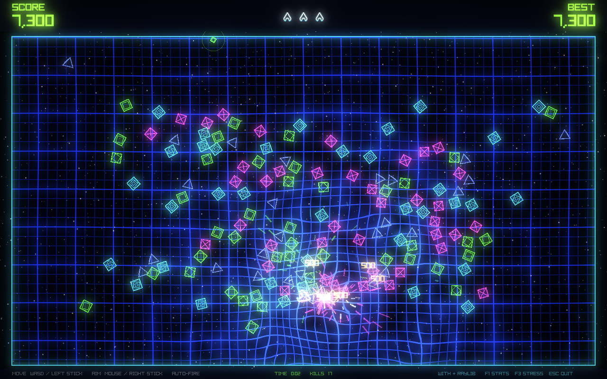
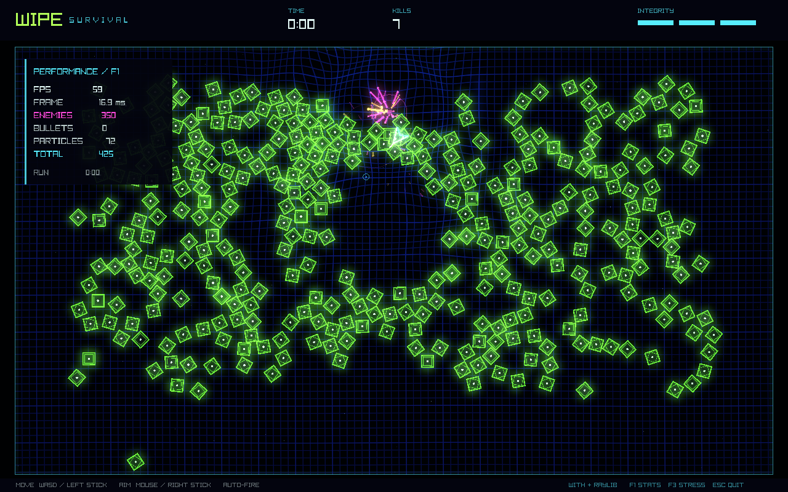
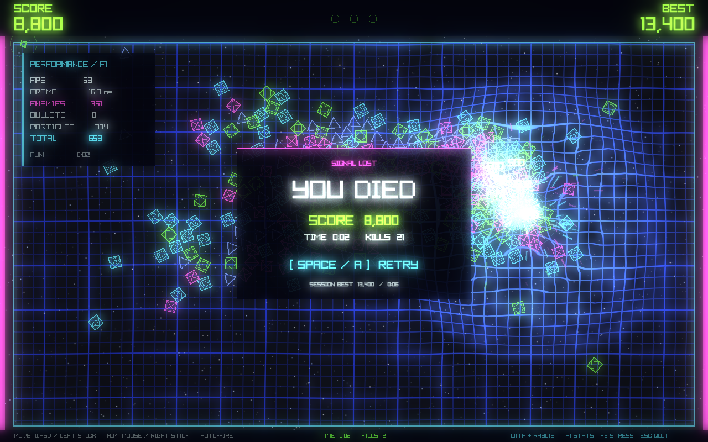
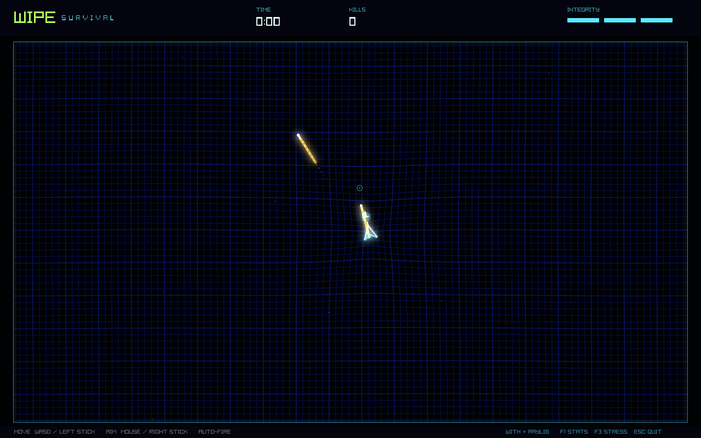

# WIPE acceptance record

## Steam and Deck implementation checks — 2026-09-30

This test phase uses an isolated With compiler candidate based on `40aaf6f9`
and WIPE based on `d93a416`. No publishing, compiler installation, Steam depot
upload, or partner configuration is part of this phase.

Confirmed so far:

- All 16 game test files pass on macOS, including controller lifecycle, input and menu
  navigation, refresh-independent simulation pacing, save recovery, replay,
  achievement retry, ordered resource cleanup, gameplay/balance targets and
  weapon bands. The final run took 259.0 seconds and is recorded in
  `out/steam-game-tests-final.txt`. The final 16-file Linux suite also passed
  inside the official Steam Runtime SDK in 313.8 seconds.
- The plain macOS game builds with no unresolved Steam API symbols and no
  `libsteam_api` dynamic dependency. SDL contains optional Steam function-name
  strings; those do not establish a linked Steam dependency.
- A separate source copy without the Steam SDK builds the plain target. The
  plain package contains exactly the executable, nine audio files and four
  shaders. A startup check from another directory reports no asset errors.
- `wipe-steam` builds and resolves `@loader_path/libsteam_api.dylib`. Both final
  Mac game variants render their first frame, close audio before the window,
  and exit with status 0 after a debugger-requested normal window close. The
  Steam variant shows its disabled-Steam fallback notice. Earlier startup
  checks also verified the Spacewar guard notice that WIPE achievements remain
  local; their timeout exits were not counted as shutdown acceptance. These
  checks do not establish end-to-end physical input.
- The complete local SDK 1.65 header imports in C++ mode. Compiler checks cover
  callback identifiers and records; 161 callback record sizes/alignments and
  all 448 fields match Clang's ABI layout.
- The Steam harness links the bundled macOS library and passes actual Spacewar
  initialization, achievement query and manual callback dispatch. The test
  achievement was locked; no achievement has been changed.
- Successful initialization followed by an unavailable stats accessor still
  permits callback dispatch and repeated, harmless cleanup.
- The deterministic disabled-Steam path passes. A separate run without a
  development App ID exercises a real SDK initialization failure (result 1),
  then verifies the fallback notice, harmless sync and repeated cleanup.
  The running Steam client was left untouched; this is not a closed-client test.
- Achievement retry contracts pass, including a regression that first failed
  before the fix: a late callback for an earlier store cannot falsely confirm
  a newer store. Missing callbacks and failures retain work with capped backoff.
- Tours completed at actual 1280×800, 1280×720 and 1920×1080 output sizes, with keyboard
  and pad prompts, pause settings and both Awards pages. Framebuffer-sized
  scene allocation, resize reuse and minimized-window handling were checked.
- The actual default-font alpha bounds for lowercase a/e/m/x are five rows in
  a ten-row font cell. The size-20 floor yields 10 visible pixels at 800p and
  9 at 720p. Assertions verify both, and 1080p captures confirm the corrected
  debug panel, ship details, pause layout and input prompts fit.
- The final Retina tour uses production's high-DPI window flag: a 1280×800
  logical window produces a 2560×1600 framebuffer and scene. All 23 captures
  have the correct full-frame dimensions. The test harness now uses
  `LoadImageFromScreen` because the pinned raylib 6 `TakeScreenshot` applies
  DPI a second time. Linked-library disassembly and the original failed capture
  are preserved; no production renderer change or image cropping was needed.
- A fresh Mac graphics fixture completed stress, death and restart with peaks
  of 1,802 enemies and 2,319 particles. At a requested 60 FPS, mean frame times
  were 16.90/16.91/17.01 ms for 150/350/1,800 enemies, with p95 ≤17.25 ms.
  Uncapped means were 1.41/1.57/4.42 ms and p95 ≤3.00/2.75/6.50 ms. These are
  desktop measurements; they do not establish Deck performance.
- The final Mac graphics fixture repeats stress, death and restart and exits
  normally. Its means are 16.87/16.88/17.00 ms with p95 ≤17.25 ms. The final
  audio fixture validates assets, the 34.9091-second music loop, preserved
  playback position on retry and clean shutdown.
- Linux builds inside the official Steam Runtime 4 SDK resolve all required
  libraries in the strict runtime environment. Both game binaries require at
  most GLIBC 2.38; the Steam build finds its bundled library through `$ORIGIN`.
  The plain package has the same 14-file allowlist as macOS.
- The strict Linux runtime passes the disabled-Steam harness and all 23 tour
  captures. Both actual game entrypoints reach drawing and exit normally after
  the debugger requests window closure. This verifies cleanup on a normal
  window-close path, not physical controller input.
- The Linux graphics fixture completed under the runtime's software renderer.
  An initial direct run exited 139 without diagnostics; debugger runs and a
  subsequent direct run completed normally. That superseded-build failure is
  retained in the evidence. The final ABI-12 build passes two direct stress
  runs, the audio fixture and both game variants' normal shutdown checks.

Local evidence is under `out/verification/mac/`, including `steam-probe.txt`,
the final `steam-*-final.txt` checks,
`plain-dependencies.txt`, `steam-dependencies.txt`, `capped-performance.txt`,
`uncapped-performance.txt`, the final graphics/audio fixture logs and the four
`tour-*` directories (including Retina).
Final Linux logs and archive inventories are under `out/verification/linux/final/`;
earlier evidence remains under `compiler/`, `game/` and `sdk/`.
These captures are automated fixtures, not physical controller acceptance.

Two Linux x86_64 test bundles are ready under `out/verification/linux/`:
`wipe-linux-x86_64-plain-test.tar.gz` and
`wipe-linux-x86_64-steam-test.tar.gz`. Their local SHA-256 checks pass. The plain
archive contains 14 files; Steam contains 15, adding only `libsteam_api.so`.
Neither contains SDK headers, the compiler, test harnesses or `steam_appid.txt`.
`LINUX-TEST-BUILDS.txt` supplies launch and hardware-test instructions;
`SHA256SUMS` and the inventories record the exact artifacts.

The compiler's empty-resource cleanup correction is committed as `b35b6d04`
(ABI 12). Its focused move/return/nested/vector regression, zero-leak allocator
check and actual game lifecycle contract pass. The full compiler battery is
**GREEN**: gate 209 seconds, remaining checks 756 seconds. This includes
self-hosting fixpoint, 1,538 behavior tests, 1,580 error-diagnostic tests,
17 codegen tests, 210 specification tests, 69 phase tests, 58 internals tests,
allocator checks, Drop/move audits and runtime/bundle checks. Evidence is in
`out/verification/compiler/`; no compiler installation or remote publication
was performed.

Outstanding: real achievement store callbacks; an overlay
open/close cycle; and physical Deck controls, docked output, suspend/resume,
performance and speaker checks. The account-mutating Spacewar test awaits
explicit approval because Steam may retain unlock history after the visible
flag is restored. The additive `--store-unchanged` harness is compiled and
ready, but automatic approval review also rejected executing that narrower
check because it submits account data to Steam. Approval was requested and
no stats submission or achievement mutation has run. Read-only modes explicitly
disable any deferred stats flush before shutdown. Desktop overlay automation is
currently blocked by macOS
ScreenCaptureKit error -3811 when selecting the running Steam client.

## Earlier prototype acceptance — 2026-09-25

Recorded 2026-09-25 UTC. This is a working prototype with measured desktop
evidence. The recruiting prototype spec was **signed off on 2026-09-25**; the
hands-on items below (physical controller acceptance, Steam Deck performance,
subjective audio approval) stay recorded as the open checks they were, and the
MVP spec picks up from here.

## Build and functional acceptance

With v0.15.2.1, raylib 6.0, Apple M5 Max, 128 GiB RAM, macOS 26.6.2.
Rendering used a 1280 × 800 desktop window, the reactive grid shader,
quarter-resolution separable Gaussian bloom, and the final composite pass.

Passed during implementation:

- `with build`, `with build :uat`, and `with build :audio-uat`.
- `with build :test`: independent movement/aim, diagonal normalization,
  analog magnitude, arena limits, firing cadence, swept collision, one-hit
  enemy death, damage invulnerability, death, retry, escalation, bounded
  pools, deterministic replay, configurable rules, radial deadzones,
  color/alpha contracts, and timing histogram behavior.
- `with run test/test_main.w --debug-alloc`: reported zero leaked allocations
  for the simulation tests. This is not a whole-application GPU/audio leak audit.
- Real GPU acceptance fixture completed ordinary combat, 350-enemy stress,
  death, retry, and maximum-load stages without a shader validation failure.
- Real audio-device acceptance verified valid assets, playback across the
  34.909-second loop boundary, and preservation of music position through
  gameplay reset. See [audio log](audio-acceptance.txt).
- The playable executable launched from `/private/tmp` without asset-load
  errors. Desktop automation could not select the unbundled native executable,
  so this check does not establish end-to-end keyboard acceptance.

The desktop fixture is a separate executable. It supplies scripted movement
and aim, disables contact damage, and forces the death/retry sequence. The
playable executable uses real input and normal contact damage. Neither the
fixture nor the clip is a human playthrough.

## Performance

Target-capped run (60 FPS requested; observed pacing approximately 59 FPS):

| Workload | Samples | Mean frame | p95 upper bound | Peak frame |
| --- | ---: | ---: | ---: | ---: |
| 150 enemies | 297 | 16.93 ms | 17.25 ms | 17.16 ms |
| 350 enemies | 157 | 16.94 ms | 17.25 ms | 17.21 ms |
| 512 enemies + sustained particles | 329 | 17.04 ms | 17.25 ms | 17.30 ms |

Uncapped run:

| Workload | Samples | Mean frame | p95 upper bound | Peak frame |
| --- | ---: | ---: | ---: | ---: |
| 150 enemies | 299 | 1.78 ms | 4.25 ms | 15.31 ms |
| 350 enemies | 159 | 2.12 ms | 4.25 ms | 4.39 ms |
| 512 enemies + sustained particles | 329 | 5.49 ms | 7.75 ms | 9.02 ms |

Both runs observed peaks of 512 enemies and 1,512 active particles. The capped
run's simulation CPU mean was 0.119 ms (maximum 0.374 ms); render submission
CPU averaged 3.008 ms (maximum 6.349 ms). Reset reused its pools and measured
below the histogram's 0.25 ms bucket resolution in a single sample. The next
rendered frame showed fresh gameplay. This is not a measured physical
button-to-photon latency result.

Frame intervals include rendering and presentation. CPU render submission
excludes `EndDrawing`; no GPU timer query was used. Percentiles are 0.25 ms
histogram upper bounds. Initial warm-up and frames affected by PNG readback
were excluded; the uncapped run took no screenshots. These are short fixture
runs on one development Mac, not long-duration or Steam Deck certification.

Raw results: [capped](capped-performance.txt),
[uncapped](uncapped-performance.txt). Reproduction commands are in
[README](../../README.md).

## Visual review

Inspected the actual GPU captures below and decoded frames from the completed
video at 10, 20, 27.25, and 30.4 seconds.

- Dense blue grid bends around the player and carries expanding impact waves.
- Green wireframe enemies retain defined edges under bloom; white/cyan player
  geometry and gold projectiles remain distinct from magenta kill sparks.
- Directional sparks, luminous trails, rings, and brief flashes provide the
  requested Geometry Wars direction without introducing extra enemy types.
- HUD and death/retry text remain sharp because they render after bloom.
- At 350 enemies, closely packed shapes still merge into bright clusters.
  This remains a tuning concern, especially on a smaller display; the result
  does not yet reproduce the reference's full particle density or variety.

The local showcase is `out/uat/wipe-showcase.mp4`: 33.0 seconds, 1280 × 800,
30 FPS H.264, stereo 44.1 kHz AAC, approximately 44.6 MB. It uses the real
simulation/rendered frames and an offline mix of the same music/effects,
volumes, pitch variation, and recorded gameplay events. It is not an audio
loopback recording. Its mix peaked at -4.68 dBFS before AAC encoding, without
needing safety attenuation. Generated video/frame files remain outside source
control; the smaller screenshots and measurements are preserved here.

## Audio review

The checked-in original soundtrack provides a 110 BPM house pulse, layered
ambient chords, sub-bass, light percussion, and delay. Five original effects
provide shot, enemy hit/death, and player damage/death cues. At the current
one-hit setting, the kill cue takes precedence over the hit cue. Events are
coalesced per rendered frame, with one reusable sound resource per cue.

The music WAV has a -2.38 dBFS sample peak, -14.93 dBFS RMS, no clipped samples,
and a -64.29 dBFS endpoint discontinuity. All five effect WAVs also have zero
clipped samples. See [sample analysis](audio-analysis.json). These checks
establish signal headroom and a small loop seam; they do not establish
professional artistic quality, perceived loudness, or speaker translation.

**Listening review is pending.** Review ordinary and dense combat on headphones
and Steam Deck speakers, including repeated retry and at least two complete
music loops. Confirm bass weight without masking, comfortable high frequencies,
clear damage/death cues, and an engaging meditative flow. The procedural music
and effects are the first reviewable candidate, not an approved final master.

## Native controller integration

SDL3 3.4.14 is now a pinned Conan dependency (`c.sdl`); the playable game uses
its gamepad subsystem alongside raylib's existing window, rendering, and audio.
No Steam Input translation, custom GLFW fork, system driver, or bridge board
is used. SDL device ownership is scoped, polling is manual with gamepad events
disabled, and discovery is limited to twice per second while disconnected.
The selected device remains stable until it disconnects. Gameplay input and
retry are gated on raylib window focus.

`with build :test` passes all four test files. New coverage exercises signed
axis endpoints, simultaneous movement/aim, radial deadzones, retained aim,
mouse takeover, combined-input normalization, and neutral disconnect behavior.
Process-local SDL virtual devices test the actual mapping and handle lifecycle:
connecting while A is held does not retry, a fresh press retries exactly once,
disconnect clears movement/buttons, and a new device can reconnect.

The installed Conan library builds and links successfully. On macOS, `build.w`
explicitly adds the SDK frameworks listed by SDL's Conan recipe because With's
dependency metadata omitted those option-guarded framework declarations. A
single selective SDL import avoids unrelated unsupported C inline helpers and
With's deduplication of C declarations before subsequent selective imports.
No compiler modifications or additional third-party dependencies were required.

An earlier isolated SDL3 C probe opened the paired Steam Controller through
Puck `28DE:1304` and observed native analog updates. The new With runner's
bounded check reported no active controller: macOS still enumerated the Puck,
and repeating the earlier C probe also reported zero joysticks. Controller
sleep is a possible cause, not a confirmed diagnosis. See the
[initial With detection result](controller-detection.txt). Physical stick/button
operation, cable PID `1302`, and real unplug/replug recovery remain pending.

Use `with build :controller-uat` and `./out/bin/controller-uat`, with Steam and
Steam Controller Bridge closed. Wake the paired controller, move both sticks,
press A, and unplug/replug the Puck. The diagnostic displays observed controls
and reports steady-state polling time on exit. Then repeat movement, aim, and
death/retry in the playable game. SDL virtual-device tests are not physical
controller certification.

Follow-up after the user reported no response: an earlier temporary With
probe was still running because it had ignored SIGTERM. It was force-closed
and its exit verified. Steam's persistent `ipcserver` launch agent was also
stopped for the current login. SDL still reported zero gamepads. A separate
read-only HID check successfully opened all four vendor-specific Puck slots
(interfaces 2–5, usage `FF00:0001`); each returned zero input reports and zero
read errors over five seconds. This narrows the current failure to the active
controller/Puck input stream, before gamepad mapping. A physical Puck reconnect
and controller power cycle were requested.

After the user asked to retry, the running With diagnostic reported
`Controller connected: Steam Controller (vendor 10462, product 4868)`.
The diagnostic was then closed before launching the playable WIPE executable;
WIPE independently reported the same connection through Puck `28DE:1304`.
Native detection is now confirmed in the actual game. The user subsequently
confirmed that the controller controls WIPE successfully: "it works!" Basic
native Steam Controller play through the Puck is accepted. This confirmation
does not separately sign off full stick range, deadzone tuning, A retry,
focus changes, or repeated reconnects; those detailed checks remain pending.

After integration, the graphics fixture passed capped and uncapped runs with
native discovery polling enabled. No active controller was detected, so these
measurements do not establish the cost of receiving live HID reports. The
capped 150/350/512-enemy means were 16.88/16.90/17.06 ms; p95 was at most
17.25 ms in every stage. With the diagnostic window closed, the final uncapped
means were 1.53/1.87/5.83 ms, with p95 bounds of 3.75/3.75/8.00 ms.
Fresh combat, stress, and death screenshots were
inspected: the cyan HUD, green wireframes, blue reactive grid, and magenta
impact effects remain intact. Dense overlapping enemies still merge into
bright clusters as noted in the earlier visual review.

Raw results: [SDL capped](sdl-capped-performance.txt),
[SDL uncapped](sdl-uncapped-performance.txt). The new screenshots are under
`out/uat/`; the earlier checked-in artistic review images remain above.

## Remaining hands-on acceptance

| Check | Procedure | Status |
| --- | --- | --- |
| Desktop input | Move with WASD while independently sweeping mouse aim; verify F1, F3, Space retry, Escape | Pending end-to-end UI check |
| Xbox dual sticks | Move and aim simultaneously; test partial magnitude, diagonals, centered-stick aim retention, A retry | Pending hardware |
| Xbox reconnect | Disconnect/reconnect during a run; ensure movement resumes without restarting | Pending hardware |
| Steam Controller + Puck | Wake paired controller; move/aim simultaneously through native SDL input; test A retry, unplug/replug, and focus loss | Basic native play confirmed by user; detailed retry/reconnect/focus checks pending |
| Steam Controller cable | Repeat the native controls and reconnect checks with PID `1302` directly over USB | Pending hardware |
| Steam Deck | Check the same controls, readability, 150/350 enemy pacing, and speaker mix | Pending hardware |
| Audio artistry | Complete the listening review above | Pending listening approval |

## Compiler issue

Filed [withlang-dev/with #1665](https://github.com/withlang-dev/with/issues/1665):
the compiler self-build RSS tripwire was applied to downstream application
compilation. The compiler was not modified for this game. Runtime pools use
preallocated vectors, which also avoid large compile-time array initializers.
